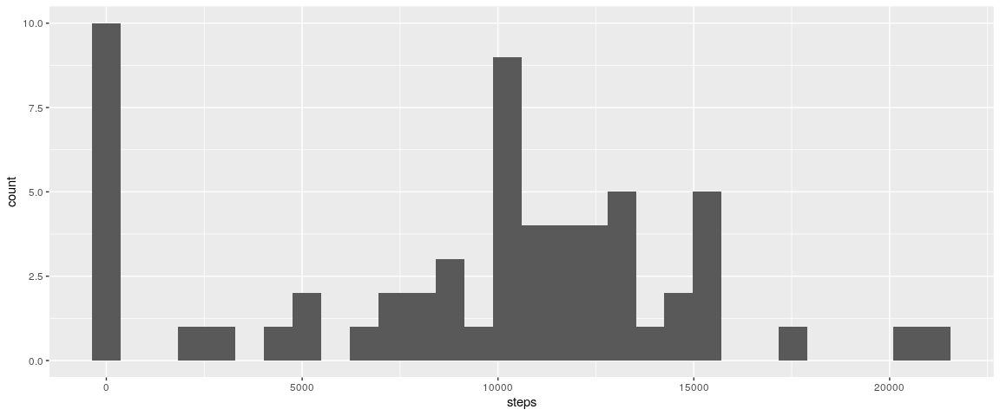
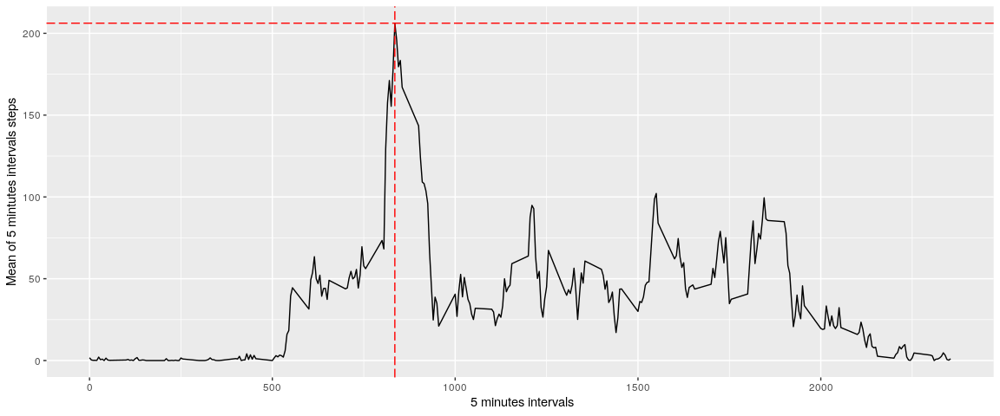
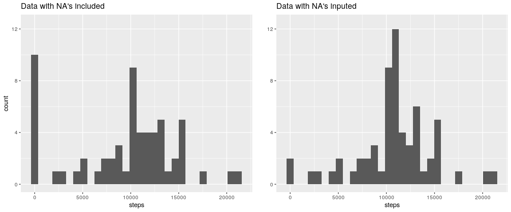
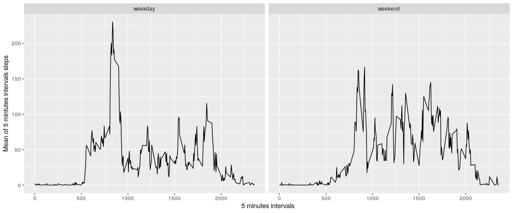

```r
library(dplyr, warn.conflicts = F)
library(ggplot2)
library(gridExtra, warn.conflicts = F)
library(lubridate, warn.conflicts = F)
```

## Loading and preprocessing the data

1. Load the data (i.e. read.csv())

```r
data <- read.csv(unz(description = "activity.zip", filename = "activity.csv"))
```

2. Process/transform the data (if necessary) into a format suitable for your analysis

```r
data$date <- as.Date(data$date)
```


## What is mean total number of steps taken per day?

For this part of the assignment, you can ignore the missing values in the dataset.

1. Make a histogram of the total number of steps taken each day


```r
steps.day <- data %>%
        group_by(date) %>%
        summarise(steps = sum(steps, na.rm = T)) 

g.steps.day <- ggplot(data = steps.day, aes(steps)) +
        geom_histogram() 
g.steps.day
```

```
## `stat_bin()` using `bins = 30`. Pick better value with `binwidth`.
```



2. Calculate and report the mean and median total number of steps taken per day


```r
steps.mean <- round(mean(steps.day$steps),0)
steps.median <- median(steps.day$steps)
```

* The **mean** is: 9354

* The **median** is: 10395


## What is the average daily activity pattern?

1. Make a time series plot (i.e. type = "l") of the 5-minute interval (x-axis) and the average number of steps taken, averaged across all days (y-axis)


```r
time.series <- data %>%
        group_by(interval) %>%
        summarise(mean = mean(steps, na.rm = T))

xintercept <-  as.numeric(time.series[time.series$mean==max(time.series$mean), "interval"])
yintercept <- as.numeric(time.series[time.series$mean == max(time.series$mean), "mean"])

ggplot(data = time.series, aes(interval, mean))+
        geom_line() +
        xlab(" 5 minutes intervals")+
        ylab("Mean of 5 mintutes intervals steps") + 
        geom_vline(xintercept =  xintercept, col = "red", linetype = "longdash") + 
        geom_hline(yintercept = yintercept, col = "red", linetype = "longdash")
```

<!-- -->

2. Which 5-minute interval, on average across all the days in the dataset, contains the maximum number of steps?


```r
xintercept <-  as.numeric(time.series[time.series$mean==max(time.series$mean), "interval"])
yintercept <- as.numeric(time.series[time.series$mean == max(time.series$mean), "mean"])
```

* The 5-minutes interval with maximum number of steps is: 835
* The maximum value of steps is: 206.1698113

## Imputing missing values

Note that there are a number of days/intervals where there are missing values (coded as NA). The presence of missing days may introduce bias into some calculations or summaries of the data.

1. Calculate and report the total number of missing values in the dataset (i.e. the total number of rows with NAs)


```r
na.number <- sum(is.na(data))
```

The total number of NA's values is: 2304


2. Devise a strategy for filling in all of the missing values in the dataset. The strategy does not need to be sophisticated. For example, you could use the mean/median for that day, or the mean for that 5-minute interval, etc.

For filling all the NA's values I used the mean of 5-minute intervals, declaring a simple condition, if a value in the ith position is "NA", then the value has to take the mean of the step value corresponding to the same ith 5-minute interval. 


```r
data.na <- data

for(i in 1:dim(data.na)[1]){
        if(is.na(data.na[i,"steps"])){
                data.na[i,"steps"] <- time.series[time.series$interval == data.na[i,"interval"],"mean"]
        }
}
```

3. Create a new dataset that is equal to the original dataset but with the missing data filled in.

Using the methology described in the last section, I show the old and new data arrays.

Fist 6 observations of orginal data set (with NA's values):

```r
head(data)
```

```
##   steps       date interval
## 1    NA 2012-10-01        0
## 2    NA 2012-10-01        5
## 3    NA 2012-10-01       10
## 4    NA 2012-10-01       15
## 5    NA 2012-10-01       20
## 6    NA 2012-10-01       25
```

Fist 6 obsevation of new data set (without NA's values):

```r
head(data.na)
```

```
##       steps       date interval
## 1 1.7169811 2012-10-01        0
## 2 0.3396226 2012-10-01        5
## 3 0.1320755 2012-10-01       10
## 4 0.1509434 2012-10-01       15
## 5 0.0754717 2012-10-01       20
## 6 2.0943396 2012-10-01       25
```


4. Make a histogram of the total number of steps taken each day and Calculate and report the mean and median total number of steps taken per day. Do these values differ from the estimates from the first part of the assignment? What is the impact of imputing missing data on the estimates of the total daily number of steps?


```r
steps.day.na <- data.na %>%
        group_by(date) %>%
        summarise(steps = sum(steps))

g.steps.day.na <- ggplot(data = steps.day.na, aes(steps)) +
        geom_histogram()+
        ggtitle("Data with NA's inputed")

grid.arrange(g.steps.day + ggtitle("Data with NA's included")+coord_cartesian(ylim = c(0,12.5)), 
             g.steps.day.na + coord_cartesian(ylim = c(0,12.5)) + ylab(""),
             ncol = 2)
```

```
## `stat_bin()` using `bins = 30`. Pick better value with `binwidth`.
## `stat_bin()` using `bins = 30`. Pick better value with `binwidth`.
```

<!-- -->

```r
steps.mean.na <- as.integer(mean(steps.day.na$steps))
steps.median.na <- as.integer(median(steps.day.na$steps))
```

The mean of dairly steps values with imputed missing data is: 10766

The median of dairly steps values with imputed mussing data is: 10766

Is important to notice that with the imputed missing data the mean and median took the same value, that is why we can interpret tha biased has been reduced. This is showed in the lasts histograms ploted, where value like "0" are distribuited across new significant values. The diference exist from the first part because in the fist section median and mean were not the same, and notice that amount of values like "0" were more.

## Are there differences in activity patterns between weekdays and weekends?

For this part the weekdays() function may be of some help here. Use the dataset with the filled-in missing values for this part.

1. Create a new factor variable in the dataset with two levels -- "weekday" and "weekend" indicating whether a given date is a weekday or weekend day.


```r
data.na.days <- data.na %>%
        mutate(day = lubridate::wday(date, week_start = 1))

data.na.days$day <- gsub(pattern = "1|2|3|4|5", replacement = "weekday", x = data.na.days$day)
data.na.days$day <- gsub(pattern = "6|7", replacement = "weekend", x = data.na.days$day)

data.na.days <- data.na.days %>%
        group_by(interval,day) %>%
        summarise(mean = mean(steps))

head(data.na.days)
```

```
## # A tibble: 6 x 3
## # Groups:   interval [3]
##   interval day       mean
##      <int> <chr>    <dbl>
## 1        0 weekday 2.25  
## 2        0 weekend 0.215 
## 3        5 weekday 0.445 
## 4        5 weekend 0.0425
## 5       10 weekday 0.173 
## 6       10 weekend 0.0165
```

2. Make a panel plot containing a time series plot (i.e. type = "l") of the 5-minute interval (x-axis) and the average number of steps taken, averaged across all weekday days or weekend days (y-axis). 

```r
ggplot(data = data.na.days, aes(interval, mean))+
        geom_line() + 
        xlab(" 5 minutes intervals")+
        ylab("Mean of 5 mintutes intervals steps") + 
        facet_grid(.~ day)
```

<!-- -->
